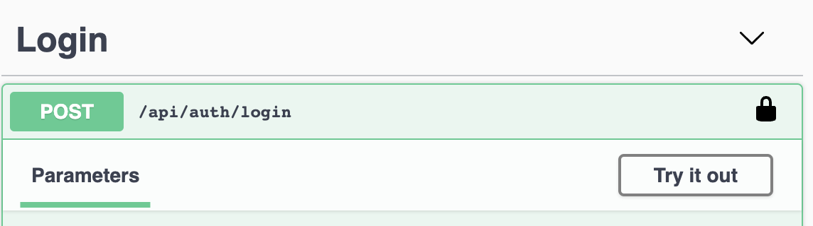
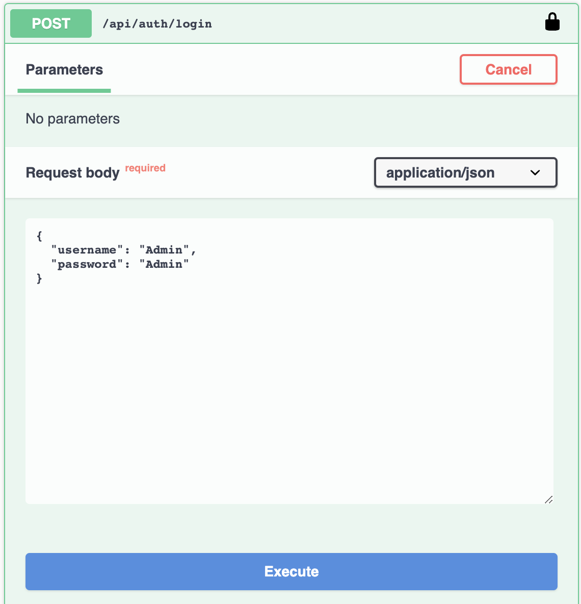
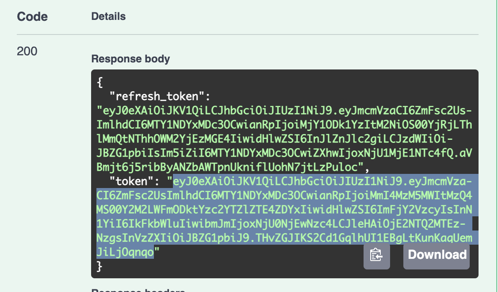
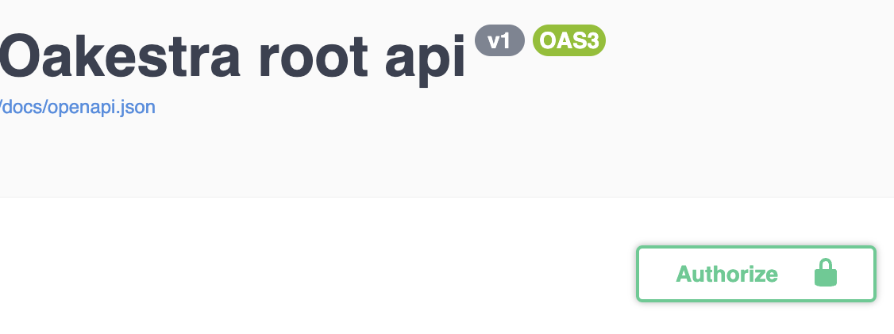
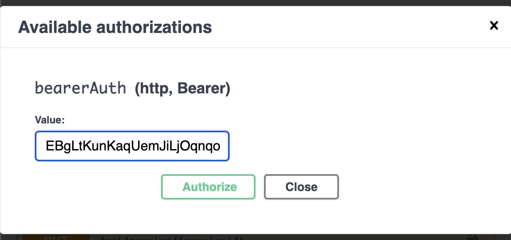
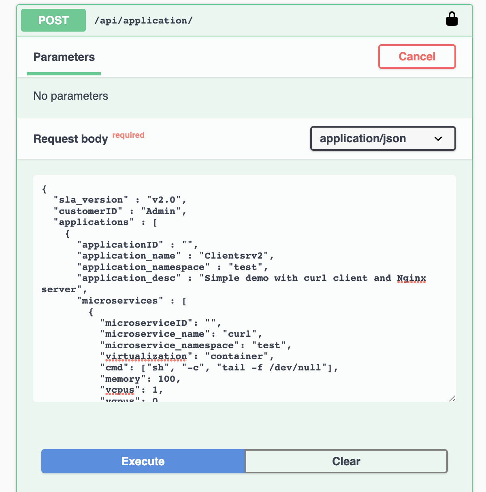

[](https://github.com/oakestra/oakestra/tree/v0.4.204)
[]()


**Oakestra** is an orchestration platform designed for Edge Computing.
Popular orchestration platforms such as Kubernetes or K3s struggle at maintaining workloads across heterogeneous and constrained devices. 
Oakestra is build from the ground up to support computation in a flexible way at the edge. 

🌐 Read more about the project at: [oakestra.io](http://oakestra.io)

📚 Check out the project wiki at: [oakestra.io/docs](http://oakestra.io/docs)

---

#### Table of Contents  
- [🌳 Get Started](#🌳-get-started)  
  - [Requirements](#requirements)
  - [Your first cluster 🪵](#your-first-cluster-🪵)
  - [Your first worker node 🍃](#your-first-worker-node-🍃)
  - [Your first application 💻](#your-first-application-💻)
- [🎯 Troubleshoot ](#🎯-troubleshoot)  
- [🛠️ How to create a development cluster](#🛠️-how-to-create-a-development-cluster)  
- [🎼 Deployment descriptor](#🎼-deployment-descriptor)  
- [🩻 Use the APIs to deploy a new application and check clusters status](#🩻-use-the-apis-to-deploy-a-new-application-and-check-clusters-status)  
- [🕸️ Networking ](#🕸️-networking)  
---

# 🌳 Get Started
<a name="🌳-get-started"></a>

Before being able to deploy your first application, we must create a fully functional Oakestra Root 👑, to that we attach the clusters 🪵, and to each cluster we attach at least one worker node 🍃.

In this get-started guide, we place everything on the same machine. More complex setups can be composed following our wiki at [oakestra.io/docs/getstarted/get-started-cluster](http://oakestra.io/docs/getstarted/get-started-cluster/).

### Requirements 
<a name="requirements"></a>

- Linux machine with iptables
- Docker + Docker Compose 

### Your first cluster 🪵
<a name="your-first-cluster-🪵"></a>
Let's start our Root, the dashboard, and a cluster orchestrator all together.

**1)** Let's set the initial environment variables

```bash
## Choose a unique name for your cluster
export CLUSTER_NAME=My_Awesome_Cluster
## Give a name or geo coordinates to the current location
export CLUSTER_LOCATION=My_Awesome_Apartment
## IP address where this root component can be reached to access the APIs
export SYSTEM_MANAGER_URL=<IP address>
# Note: Use a non-loopback interface IP (e.g. any of your real interfaces that have internet access).
# "0.0.0.0" leads to server issues
```

A location can be in the following forms:
- < STRING > representing a location name. E.g., `my_home`
- LATITUDE,LONGITUDE,RADIUS representing the geographical area covered by this cluster. E.g., `48.1397,11.5451,1000`, which represents an area of 1km from Munich city center.  

**2)** Clone and move inside the repo

```bash
# Feel free to use https or ssh for cloning
git clone https://github.com/oakestra/oakestra.git && cd oakestra
```

**3)** Start the root and cluster orchestrator using the `1-DOC.yaml` compose file.

```bash
sudo -E docker-compose -f run-a-cluster/1-DOC.yaml up
# If this should not work for you try "docker compose" instead
```

**1-DOC** stands for 1 Device One Cluster, meaning that all the components are deployed locally. 

### Your first worker node 🍃
<a name="your-first-worker-node-🍃"></a>

Download and install the Node Engine and the Network Manager:
```
wget -c https://github.com/oakestra/oakestra/releases/download/v0.4.203/NodeEngine_$(dpkg --print-architecture).tar.gz && tar -xzf NodeEngine_$(dpkg --print-architecture).tar.gz && chmod +x install.sh && mv NodeEngine NodeEngine_$(dpkg --print-architecture) && ./install.sh $(dpkg --print-architecture)
```
```
wget -c https://github.com/oakestra/oakestra-net/releases/download/v0.4.203/NetManager_$(dpkg --print-architecture).tar.gz && tar -xzf NetManager_$(dpkg --print-architecture).tar.gz && chmod +x install.sh && ./install.sh $(dpkg --print-architecture)
```

Configure the Network Manager by editing `/etc/netmanager/netcfg.json` as follows:
```json
{
  "NodePublicAddress": "<IP ADDRESS OF THIS DEVICE>",
  "NodePublicPort": "<PORT REACHABLE FROM OUTSIDE, use 50103 as default>",
  "ClusterUrl": "<IP Address of cluster orchestrator or 0.0.0.0 if deployed on the same machine>",
  "ClusterMqttPort": "10003"
}
```

Start the NetManager on port 6000
```
sudo NetManager -p 6000
```

On a different shell, start the NodeEngine with the -6000 paramenter to connect to the NetManager. 
```
sudo NodeEngine -n 6000 -p 10100 -a <Cluster Orchestrator IP Address>
```

If you see the NodeEngine reporting metrics to the Cluster...

🏆 Success!

#### ✨🆕✨ If the worker node machine has [KVM](https://phoenixnap.com/kb/ubuntu-install-kvm) installed and it supports nested virtualization, you can add the flag `-u=true` to the NodeEngine startup command to enable Oakestra Unikernel deployment support for this machine.

### Your first application 💻
<a name="your-first-application-💻"></a>

Let's use the dashboard to deploy you first application. 

Navigate to `http://SYSTEM_MANAGER_URL` and login with the default credentials:
-  Username: `Admin`
-  Password: `Admin`

Deactivate the Organization flag for now. *(Not like it is depicted in the reference image)*


Add a new application, and specify the app name, namespace, and description. 
**N.b.: Max 8 characters for app name and namespace**


Then, create a new service using the  button. 

Fill the form using the following values: 
**N.b.: Max 8 characters for service name and namespace**


```
Service name: nginx
Namespace: test
Virtualization: Container
Memory: 100MB
Vcpus: 1
Vgpus: 0
Vtpus: 0
Bandwidth in/out: 0
Storage: 0
Port: 80
Code: docker.io/library/nginx:latest
```

Finally, deploy the application using the deploy button.

<p>

</p>

Check the application status, IP address, and logs.

<p>

</p>


The Node IP field represents the address where you can reach your service. Let's try to use our browser now to navigate to the IP 131.159.24.51 used by this application. 


# 🎯 Troubleshoot
<a name="🎯-troubleshoot"></a>

- #### 1-DOC startup sends a warning regarding missing cluster name or location.
  After exporting the env variables at step 1, if you're using sudo with docker-compose, remember the `-E` parameter.

- #### NetManager bad network received 
  Something is off at the root level. Most likely, the cluster network component is not receiving a subnetwork from the root. Make sure all the root components are running. 

- #### NetManager timeout
  The cluster network components are not reachable. Either they are not running, or the config file `/etc/netmanager/netcfg.json` must be updated.

- #### Deployment Failed: NoResourcesAvailable/NoTargetCluster
  There is no worker node with the specified capacity or no worker node deployed at all. Are you sure the worker node startup was successful?

- #### Wrong Node IP displayed
  The node IP is from the cluster orchestrator perspective so far. If it shows a different IP than expected, it's probably the IP of the interface used to reach the cluster orchestrator. 

- #### Other stuff? Contact us on Discord!

# 🛠️ How to create a multi-cluster setup
<a name="🛠️-how-to-create-a-development-cluster"></a>

### Root Orchestrator 

First, initialize a Root orchestrator. 
On a Linux machine first, install Docker and Docker-compose. Then, run the following commands to set up the Root Orchestrator components.

```bash
export SYSTEM_MANAGER_URL=<Address of current machine> #Used by the dashboard
cd root_orchestrator/
docker-compose up --build 
```

The following ports are exposed:

- Port 80 - Dashboard 
- Port 10000 - System Manager (It also needs to be accessible from the Cluster Orchestrator)


### Cluster Orchestrator

For each cluster, install one cluster orchestrator. 

- Log into the target machine/vm you intend to use
- Install Docker and Docker-compose.
- Export the required parameters:

```
export SYSTEM_MANAGER_URL=" < ip address of the root orchestrator > "
export CLUSTER_NAME=" < name of the cluster > "
export CLUSTER_LOCATION=" < location of the cluster > "
```

- Then, run the following commands to set up the Cluster Orchestrator components. 

```bash
cd cluster_orchestrator/
docker-compose up --build 
```

The following ports are exposed:

- 10100 Cluster Manager (needs to be accessible by the Node Engine)

### Worker nodes -  Node Engine

For each worker node you can either use the pre-compiled binaries or compile them on your own. 

*Requirements*
- Linux OS with the following packages installed (Ubuntu and many other distributions natively supports them)
  - iptable
  - ip utils
- port 50103 available

Compile and install the binary with:
```
cd go_node_engine/build
./build.sh
./install.sh $(dpkg --print-architecture)
```

Then configure the NetManager and perform the startup as usual. 

N.b. each worker node can now be configured to work with a different cluster.  

# 🎼 Deployment descriptor
<a name="🎼-deployment-descriptor"></a>

Together with the application, it's possible to perform a deployment by passing a deployment descriptor (or SLA) in `.json` format to the APIs or the frontend.

Since version 0.4, Oakestra (previously, EdgeIO) uses the following format for a deployment descriptor format. 

E.g.: `deploy_curl_application.yaml` 

```json
{
  "sla_version" : "v2.0",
  "customerID" : "Admin",
  "applications" : [
    {
      "applicationID" : "",
      "application_name" : "clientsrvr",
      "application_namespace" : "test",
      "application_desc" : "Simple demo with curl client and Nginx server",
      "microservices" : [
        {
          "microserviceID": "",
          "microservice_name": "curl",
          "microservice_namespace": "test",
          "virtualization": "container",
          "cmd": ["sh", "-c", "tail -f /dev/null"],
          "memory": 100,
          "vcpus": 1,
          "vgpus": 0,
          "vtpus": 0,
          "bandwidth_in": 0,
          "bandwidth_out": 0,
          "storage": 0,
          "code": "docker.io/curlimages/curl:7.82.0",
          "state": "",
          "port": "9080",
          "added_files": []
        },
        {
          "microserviceID": "",
          "microservice_name": "nginx",
          "microservice_namespace": "test",
          "virtualization": "container",
          "cmd": [],
          "memory": 100,
          "vcpus": 1,
          "vgpus": 0,
          "vtpus": 0,
          "bandwidth_in": 0,
          "bandwidth_out": 0,
          "storage": 0,
          "code": "docker.io/library/nginx:latest",
          "state": "",
          "port": "6080:80/tcp",
          "addresses": {
            "rr_ip": "10.30.30.30"
          },
          "added_files": []
        }
      ]
    }
  ]
}
```

This deployment descriptor example describes one application named *clientsrvr* with the `test` namespace and two microservices:
- nginx server with test namespace, namely `clientsrvr.test.nginx.test`
- curl client with test namespace, namely `clientsrvr.test.curl.test`

This is a detailed description of the deployment descriptor fields currently implemented:
- sla_version: the current version is v0.2
- customerID: id of the user, default is Admin
  - application list, in a single deployment descriptor is possible to define multiple applications, each containing:
    - Fully qualified app name: A fully qualified name in Oakestra is composed of 
        - application_name: unique name representing the application (max 10 char, no symbols)
        - application_namespace: namespace of the app, used to reference different deployment of the same application. Examples of namespace name can be `default` or `production` or `test` (max 10 char, no symbols)
        - applicationID: leave it empty for new deployments, this is needed only to edit an existing deployment.  
    - application_desc: Short description of the application
    - microservice list, a list of the microservices composing the application. For each microservice the user can specify:
      - microserviceID: leave it empty for new deployments, this is needed only to edit an existing deployment.
      - Fully qualified service name:
        - microservice_name: name of the service (max 10 char, no symbols)
        - microservice_namespace: namespace of the service, used to reference different deployment of the same service. Examples of namespace name can be `default` or `production` or `test` (max 10 char, no symbols)
      - virtualization: currently the supported virtualization are `container` or (✨🆕✨) `unikernel`
      - cmd: list of the commands to be executed inside the container at startup or the unikernel parameters
      - environment: list of the environment variables to be set, E.g.: ['VAR=fOO'].
      - vcpu,vgpu,memory: minimum cpu/gpu vcores and memory amount needed to run the container
      - vtpus: currently not implemented
      - code: public link of OCI container image (e.g. `docker.io/library/nginx:latest`) or (✨🆕✨) link to unikernel image in `.tar.gz` format (e.g. `http://<hosting-url-and-port>/nginx_x86.tar.gz`).
      - storage: minimum storage size required (currently the scheduler does not take this value into account)
      - bandwidth_in/out: minimum required bandwidth on the worker node. (currently the scheduler does not take this value into account)
      - port: port mapping for the container in the syntax hostport_1:containerport_1\[/protocol];hostport_2:containerport_2\[/protocol] (default protocol is tcp)
      - addresses: allows to specify a custom ip address to be used to balance the traffic across all the service instances. 
        - rr\_ip: [optional field] This field allows you to setup a custom Round Robin network address to reference all the instances belonging to this service. This address is going to be permanently bounded to the service. The address MUST be in the form `10.30.x.y` and must not collide with any other Instance Address or Service IP in the system, otherwise an error will be returned. If you don't specify a RR_ip and you don't set this field, a new address will be generated by the system.
      - constraints: array of constraints regarding the service. 
        - type: constraint type
          - `direct`: Send a deployment to a specific cluster and a specific list of eligible nodes. You can specify `"node":"node1;node2;...;noden"` a list of node's hostnames. These are the only eligible worker nodes.  `"cluster":"cluster_name"` The name of the cluster where this service must be scheduled. E.g.:
         
    ```
    "constraints":[
                {
                  "type":"direct",
                  "node":"xavier1",
                  "cluster":"gpu"
                }
              ]
    ```
    
#### Dashboard SLA descriptor
From the dashboard you can create the application graphically and set the services via SLA. In that case you need to submit a different SLA, contianing only the microservice list:

```json
{
  "microservices": [
    {
      ...
    }
  ]
}
```
 
# 🩻  Use the APIs to deploy a new application and check clusters status
<a name="🩻-use-the-apis-to-deploy-a-new-application-and-check-clusters-status"></a>


### Login
After running a cluster you can use the debug OpenAPI page to interact with the apis and use the infrastructure.

connect to `<root_orch_ip>:10000/api/docs`

Authenticate using the following procedure:

1. locate the login method and use the try-out button

2. Use the default Admin credentials to login

3. Copy the result login token

4. Go to the top of the page and authenticate with this token



### Register an application and the services
After you authenticate with the login function, you can try out to deploy the first application. 

1. Upload the deployment description to the system. You can try using the deployment descriptor above.


The response contains the Application id and the id for all the application's services. Now the application and the services are registered to the platform. It's time to deploy the service instances! 

You can always remove or create a new service for the application using the /api/services endpoints.

### Deploy an instance of a registered service 

1. Trigger a deployment of a service's instance using `POST /api/service/{serviceid}/instance`

each call to this endpoint generates a new instance of the service

### Monitor the service status

1. With `GET /api/aplications/<userid>` (or simply /api/aplications/ if you're admin) you can check the list of the deployed application.
2. With `GET /api/services/<appid>` you can check the services attached to an application
3. With `GET /api/service/<serviceid>` you can check the status for all the instances of <serviceid>

### Undeploy 

- Use `DELETE /api/service/<serviceid>` to delete all the instances of a service
- Use `DELETE /api/service/<serviceid>/instance/<instance number>` to delete a specific instance of a service
- Use `DELETE /api/application/<appid>` to delete all together an application with all the services and instances

### Cluster Status
- Use `GET /api/clusters/` to get all the registered clusters.
- Use `GET /api/clusters/active` to get all the clusters currently active and their resources.
## Unikernel
It is also possible to use Unikernels by changing the virtulization in of the microservice
```json
{
	"sla_version": "v2.0",
	"customerID": "Admin",
	"applications": [{
		"applicationID": "",
		"application_name": "nginx",
		"application_namespace": "test",
		"application_desc": "Simple demo of an Nginx server Unikernel",
		"microservices": [{
			"microserviceID": "",
			"microservice_name": "nginx",
			"microservice_namespace": "test",
			"virtualization": "unikernel",
			"cmd": [],
			"memory": 100,
			"vcpus": 1,
			"vgpus": 0,
			"vtpus": 0,
			"bandwidth_in": 0,
			"bandwidth_out": 0,
			"storage": 0,
			"code": "https://github.com/Sabanic-P/app-nginx/releases/download/v1.0/kernel.tar.gz",
			"arch": ["amd64"],
			"state": "",
			"port": "80:80",
			"addresses": {
				"rr_ip": "10.30.30.26"
			},
			"added_files": []
		}]
	}]
}
```
Differences to Container Deployment:
- virtualization: set to unikernel
- code: Specifies a the remote Unikernel accessible via http(s). There can be multiple
        Unikernels in the same string seperated via ",".
- arch: Specifies the architecture of the Unikernel given in code. The order of
        architectures must match the order of Unikernles given via the code field


# 🕸️ Networking
<a name="🕸️-networking"></a>

The network component is maintained in: [https://www.oakestra.io/docs/networking](https://www.oakestra.io/docs/networking)
