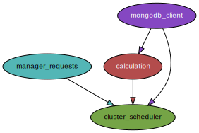

# Cluster_Scheduler

The Cluster Scheduler calculates detailed placement where an application should be deployed within a cluster. It mainly interacts with the Cluster Manager to get tasks and calculate scheduling decisions.

## How the Cluster Scheduler works internally

- Job request is received by Flask endpoint
- Job is forwarded to Celery server
- Celery adds it to Redis Queue
- Celery worker starts working
  - it looks which nodes are available and creates a list of available and qualified for the job. Whether technology is supported, cpu and memory are enough, if it is active.
  - it looks which of the qualified workers suits best for the job by looking which has the highest cpu, memory values, and creates a prioritized list of workers 
  - response is returned to cluster-mananger

## Create Python Dependency Graph

- https://github.com/thebjorn/pydeps
    - apt install graphviz
    - pip install pydeps
    - pydeps [args] python_file_name.py
    - e.g. `pydeps --max-bacon 3 --max-cluster-size=1000 cluster_scheduler.py`

## Usage

- see, edit and use the start-up script: `./start-up.sh` . Set the env vars accordingly.

## Run Celery in Pycharm

- Script Path: absolute path to celery in virtual environment (in virtual environment, the global system celery was not reachable)
- Working Directory to project directory
- Celery parameters: `-A cluster_scheduler.celeryapp worker --concurrency=1 --loglevel=INFO`
- A related post on stackoverflow: https://stackoverflow.com/questions/37150910/how-can-i-use-pycharm-to-locally-debug-a-celery-worker
- System Celery was not reachable, instead the celery in the virtual environment works in Pycharm
- Set virtual environment and install all requirements, also celery via Pip
- Set another `Run Configuration` for Flask: Flask Server runs in one console, celery server and worker in another

## Debug Celery in Pycharm

- debug mode does not work in Pycharm 2020.2. Pycharm does not stop at Breakpoints.
- But it works in Pycharm 2020.1. Breakpoints work.
- install pycharm snap with `sudo snap install pycharm-professional --channel=2020.1 --classic` or change install with refresh if you already have pycharm installed
- follow the instructions above to set up celery Run Configuration in Pycharm
- On my Linux Mint (and perhaps all other Linux Distros), I am able to install the latest Pycharm 2020.2 as Flatpack and in parallel a Pycharm 2020.1 Snap provided by Snap (Canonical). I open the Celery based Scheduler in the snap and all other components in the Flatpack Window.
