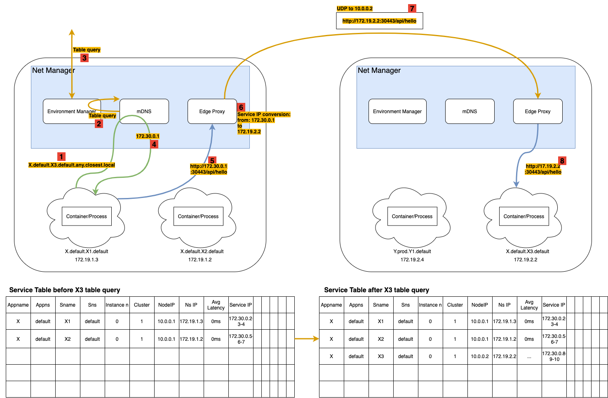
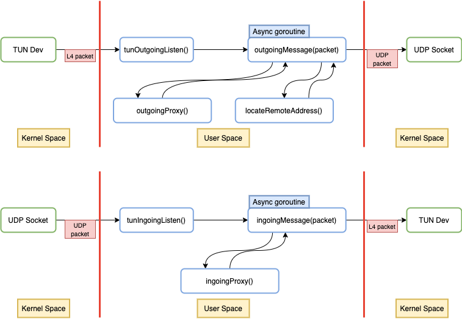

#Eeast West traffic handling
## ( Service to Service Communication )

service to service traffic can be handled directly by the communication overlay channel. 

## Networking overlay network

### Node identification
Each node from the networking point of view is identified by the following info:
**Ip Address + EWP**

**EWP**: East west traffic port. Port used for host to host communication. 

### Service Identification
If several devices are behind NAT each one is going to have his own port. These informations must be comunicted to the cluster orchestrator during the initial handshake. 

Each service from the networking point of view is constituted by the following informations:

- 3 Service IP Addresses assigned at deploy time by the orchestrator from the range 172.30.0.0/16. These addresses are virtual. These are the only addresses that are going to be used by the users and allows EdgeIO to perform L4 load balancing in a smart way. 
	- ServIP 1: closest service IP, instruct the proxy to forward the packet to the closest available service
	- ServIP 2: balanced service IP, instruct the proxy to forward the packet to with load balancing scheme
	- ServIP 3: fastbalance service IP, instruct the proxy to forward the packet to the closest node balancing the load optimizing by latency and dinstance.
	- If more load balancing techniques are in place more of these addresses can be assigned
- Node IP: Ip address of the node where the service has been deployed
- Node EWP: Node EastWest port used for the tunneling
- Node NSP: Node NorthSouth port used for the tunneling
- NamespaceIP: Ip of the network namespace used for internal routing. Assigned by the node machine at deploy time according to the node subnetwork.

## Overlay traffic handling

## Different type of deployments for a service

* Service
	* Container, Unikernel or bare metal app 
	* Can expose ports to other deployed services 
	* Can specify other services that he needs to talk to
* Exposed service - Is a service but with the following features:
	* It is exposed to the internet	 

## Internal mDNS naming scheme (E-W traffic)

`http://appname.appns.servicename.servicens.instancenumber.policy.local:port/api`

* appname: name of the application where this service belong
* appns: namespace of the application. E.g. test, prod, develop
* servicename: name of the service that is beeing deployed
* servicenamespace: namespace of the service. Like version1, test or whatever.
* instancenumber: 
	* any: used for stateless services. 
	* 1...n: number representing the specific instance of a statefull service
* policy: routing policy
	* closest: this policy chooses the closest instance to the current service
	* fastest: this policy chooses the instance with highest throughput (latency+load optimization)
	* roundrobin
	* fixed: used for statefull services, no other option can be specified in that case. 
	* other: other ideas?

## Service deployment descriptor. What do we need so far?

* Appname: string
* Appnamespace: string
* Servicename: string
* Servicenamespace: string
* exposed: bool
* needs: [hostnames]
* ports: [int]
* statefull: bool
