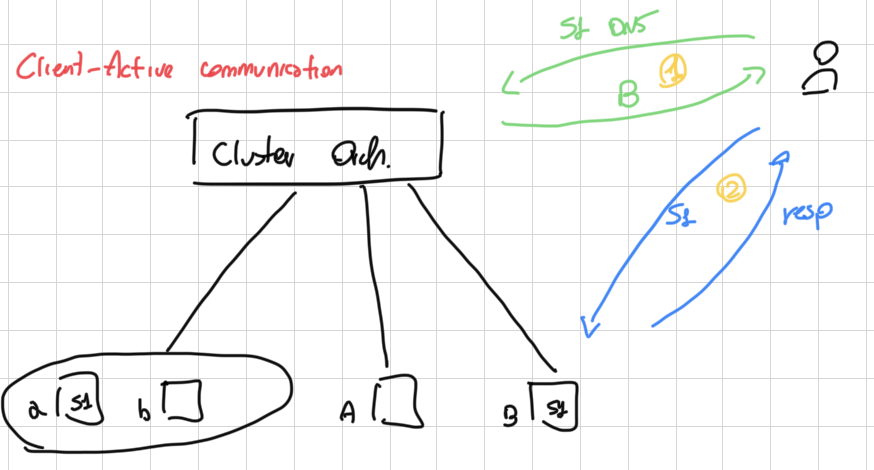
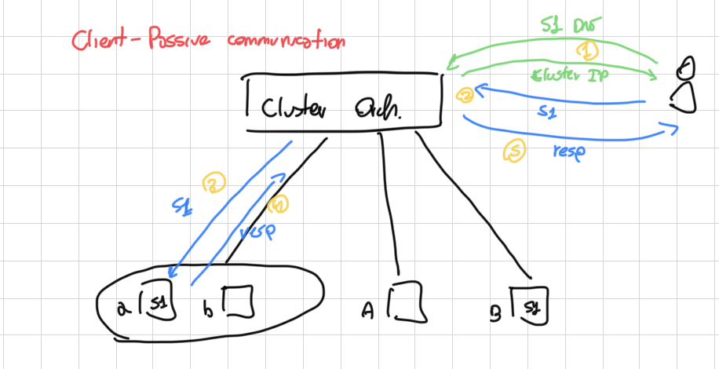
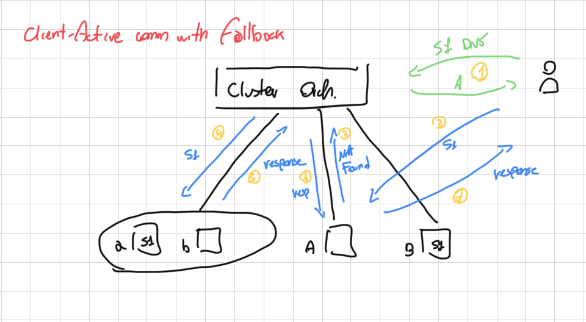
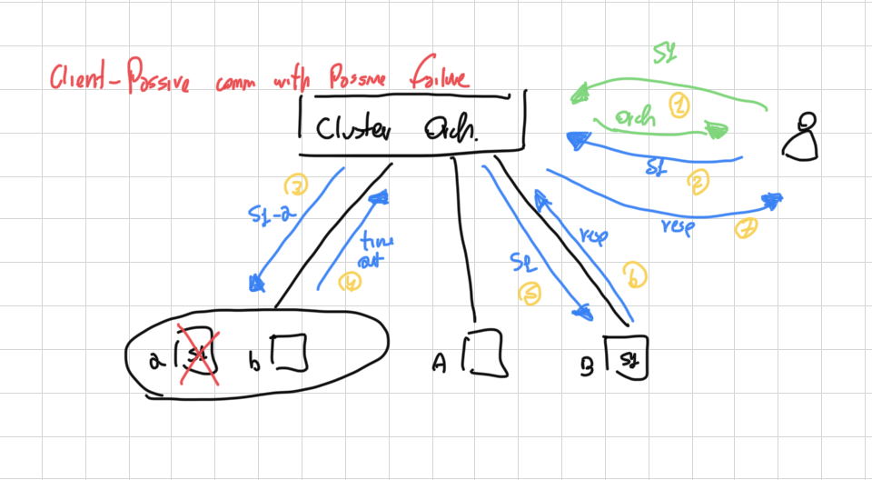
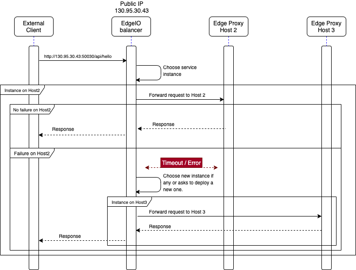
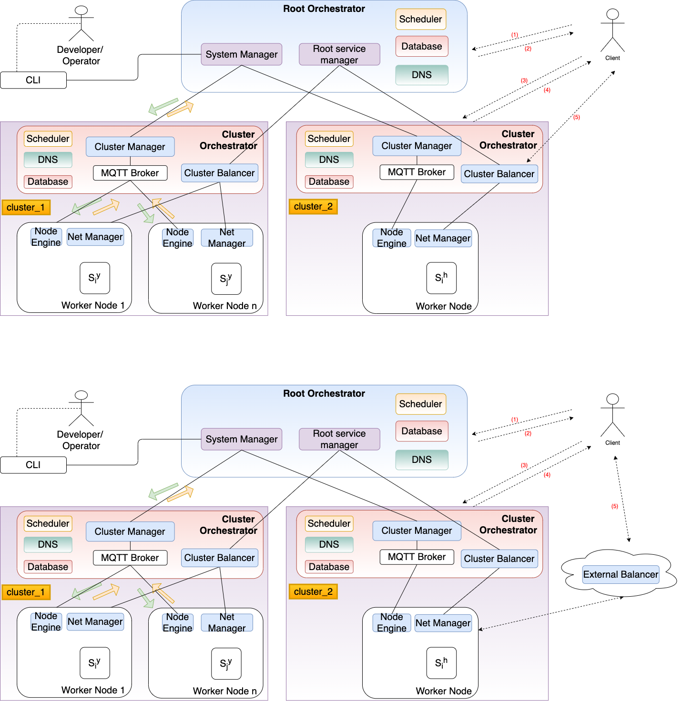

### Solution proposal A 

Comunication directly to the Edge devices

* This solution needs a strong fallback mechanism
* Problems if we answer with a different IP?
* Edge devices must be strong enough
* Works only with devices publicly accesible
* Exposing edge devices to the internet is not always a good idea. 
* Fails if the Node becomes unreachable

### Solution proposal B

All goes trough the Cluster Orchestrator.

* Orchestrator must be very reliable, only a cloud at the edge can handle this solution
* NAT traversal becomes automatic
* No need to expose meny ports from the edge devices

### Solution proposal C

Let's do both. 

Let's cassify devices as:

* Active devices: reliable device with public IP accessible from outside
* Passive devices: Devices that may be behind NAT, that should not be exposed to the internet and that may fail often

then we use

* Solution A with Active devices
* Solution B with Passive devices

#### Usecases:

1) Dns query answer host B

2) Client contact B, B contains the correct service and answers

1) Dns query answer with cluster orchestrator IP

2) Client make the request to the cluster orchestrator

3) Cluster orch redirect to actual node

4) Service sends answer to cluster orch

5) Cluster orch answer back to the client 

1) Dns query answer host B (wrongly, maybe is not updated)

2) Client contact B 

3) B does not contain the service anymore and fallbacks to the root orchestrator

4) Root orch locates the service and forwards there the request

5) Service answers back

6) Root orch answers back the client (evaluate if this creates problems) 

n.b. the picture is wrong

4) a is no more available

5) Root orch handle this automatically and forward the request to another device

6) the service ansewrs like the host is a normal passive device

7) the answer is routed back to the client 

No way to recover

####Considerations

We want to create a view where all the devices are the same, regardless of the fact that they are behind nat, smaller or bigger. From networking point of view we should not have such a difference. 

Plust we still have the failure in case of Unreachable host. 

### Solution proposal D
Relying too much on DNS can be dangerous

According to [Kubernetes official documentation](https://kubernetes.io/docs/concepts/services-networking/service/)

>Why not use round-robin DNS? 
>
>A question that pops up every now and then is why Kubernetes relies on proxying to forward inbound traffic to backends. What about other approaches? For example, would it be possible to configure DNS records that have multiple A values (or AAAA for IPv6), and rely on round-robin name resolution?
>
>There are a few reasons for using proxying for Services:
>
>There is a long history of DNS implementations not respecting record TTLs, and caching the results of name lookups after they should have expired.
>Some apps do DNS lookups only once and cache the results indefinitely.
>Even if apps and libraries did proper re-resolution, the low or zero TTLs on the DNS records could impose a high load on DNS that then becomes difficult to manage.

Let's use then Solution B but with an external Load Balancing component. The external load balancer can be deployed even on another Cloud. This solution is hevily inspired from Kubernetes but is a solution appriciated from the community and gives flexibility to the developers. We provide a cluster LoadBalancer with the possibility to deploy other external LoadBalancers. 

#### Proposed architecture

**Schema**

**DNS Resolution**

 
**North South traffic** 

#### Pros and Cons

**\+** Edge devices not directly exposed to client traffic

**\+** Avoid problems related to client-side strange DNS behaviours 

**\+** Enable scalability for the Balancer

**\+** The nodes only needs to expose one or two ports according to the implementation

**\+** Enable the possibility of fully customize the load balancing algorithm without the need to care about TTL since we manage the communication channel

**\-** All the External Balancers must be kept synchronized with the Cluster Orchestrator in order to enforce a good balancing policy

**\-** Exposes Internal mechanism to the developer (only in case of external Load Balancer)

**\-** External Balancers services must register to the Cluster Orchestrator anyway

**\-** A distant external Balancer may cause higher latency 

## DNS name resolution 

Hierarchical DNS resolution. Top level DNS component resolve with the cluster DNS subdomain according to an optimization algorithm. This first step reoslution may have an high TTL to avoid load at the Root Orchestrator. The TopLevel DNS component may be deployed independently. 

### Example
1) User tries to resolve the dns address with the top level DNS. 
The address is going to be something like 
`www.hx2351kfslk.edgeio.de:50333/something`

2) The edge io top domanin dns answers with the best fitting cluster for the request. In this case cluster 2 DNS server. Caching level -> High.

3) The client contacts the Cluster 2 DNS for the name resolution. 

4.1) If service deployed in current cluster. Answers with the IP address of one of the currently deployed LoadBalancers for this cluster. Caching level depends on Cluster configuration. Default -> low. 5 minutes. 

4.2) If service not found, top level query for any other cluster instance for this service. Returns the new DNS server of fail. (In this case cache level -> high)

5) Communication with choosen Load Balancer

## DNS TTL optimization

In order to avoid high load on the DNS hierarchy the goal is to optimize as much as possible the TTL sent for each record. 

### TopLevel DNS caching

Top level DNS (configured as iterative DNS for performance reasons) answers with clusters Domain Name Servers entry. This information can have a high TTL according to the fact that clusters in EdgeIO are not meant as higly dinamic entities.

Range: **10800 (3h) - 86400 (24h)**

### Cluster level DNS caching

Cluster level DNS caching must have a lower TTL considering that EdgeEnvironment can be very mutable.

**Higher TTL leads to:**

* Decrease the load of the DNS component
* Increase the overhead for rerouting in case of migrated service. 
* Broken connection in case of host crash until next DNS update. 

**Lower TTL leads to:**

* Increase the load of the DNS component for external call
* Decrease the overhead for rerouting in case of migrated services since the DNS resolution get updated informations more often
* In case of host crash the connection is restored faster

Range: **10 (10 seconds) - 21600 (6 hours)**

## DNS Single point of failure avoidance proposal

### High availability deployment
DNS component deployed with a load balancer. Even if they don't get updated syncrhonously we still have the bouncing mechanism.

### External deployment
We can give the possibility to deploy the DNS servers (or at least the central one) directly to another cloud as external component.

### Avoid top level DNS 
Register to the provider directly cluster level resolution components. 

## External DNS naming scheme

`servicehash.cluster.edgeiodomain.topleveldomain`

* Servicehash: hash provided by EdgeIO composed of
	* App name
	* app namespace name
	* service name
	* service namespace name
* Cluster: 
	* It can be directly the "clustername". 
	* It can be "defau lt" for round robin based on where there is a matching service
* Edgeiodomain: Registered domain of edge io for the main DNS server.
* topleveldomain: .it, .de, .com etc.  
