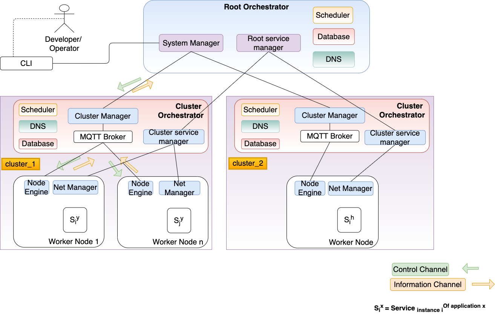
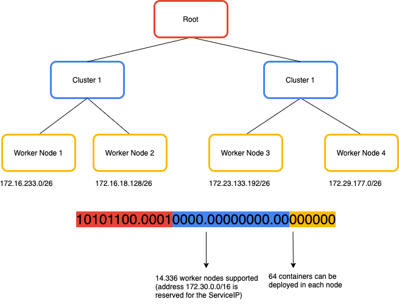
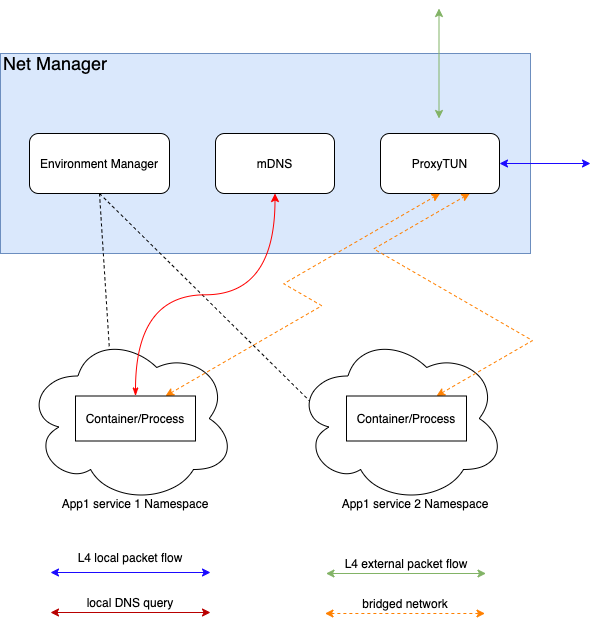
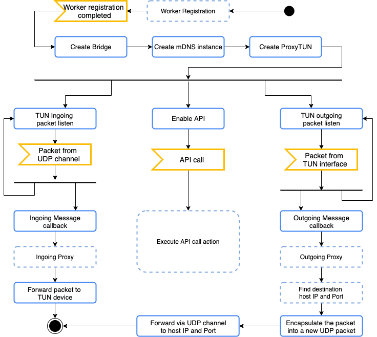

# Network high level architecture

## Presentation slides
[Gslides](https://docs.google.com/presentation/d/1_vSy4f2plYYKcQKtr5tQ1ColA5VtPYPFwhbaViDtcM4/edit?usp=sharing)

## Architecture schema



## Worker node subnetworks



## Worker Node NetManager Implementation



With the net manager we use 3 main components:

* Environment Manager: This component is responsible for:
	* When a NetManager component is deployed the NodeManager gives him a new subnetwork space. 
	* The creation of an instance of the EdgeProxy device 
	* The creation of the Host bridge
	* The communication with the Node Manager 
	* During the deploy of a new container, it creates the net namespace, it assigns to it a new local ip address from his subnetwork space.
	* The retrieval of all the needed routes. If a service needs to communicate with another one, the env manager sends a query to the cluster service manager for that. 	
	* Whenever a route changes outside of the node, the cluster service manager contancts this component
	* Whenever a deployment changes or there is an internal failure, this component notify immediately the cluster service manager in order to propagate the route change
	* Updates the mDNS routes accordingly to the needed routes described in the deployment descriptor of the services
* mDNS translates locally the requests
	*  Here is where the logic for all the smart routing procedures takes place
	*  The service resolution table belongs here and updated by the environment manager
* ProxyTUN: all requests are routed into this component
	* This device routes all the Service requests to the correct destination, either on the same machine or tunneled to another machine. 
	*  This device also performs load balancing based on the ServiceIP (Check the Service to service section)
	* This is implemented as a process behind the TUN device
	* The host resolution table is maintained here and updated by the environment manager
	* The communication channel is implemented wrapping the the L4 packet inside a bigger UDP packet containing the address of the actual host machine. Once the packet arrives to the ProxyTUN of the other host machine the packet is unwrapped and dispatched by the bridge like if it was from the same machine
	* When the proxy receives a packet from another machine it maintains the new host address in a cache in order to enable the response.

###NetManager flowchart


* Worker Reigstration
	*  Registration of the node with the Cluster Orc. 
	*  A container subnetwork is assigned to the node
	*  The internal container private addresses are going to be assigned from this subnetwork

* API
   * The REST api interface is enabled after a succesfull call of the `/register` endpoint. 
   * This API is intended for the exclusive use from the node_egine and currently exposes only
   the `/docker/deploy` and `/docker/undeploy` methods. 
   
```json
Endpoint: /docker/deploy
Usage: used to assign a network to a docker container. This method can be used only after the registration
Method: POST
Request Json:
	{
		containerId:string #name of the container or containerid
		appName:string
		instanceNumber:int
		nodeIp:string
		nodePort:int
		serviceIp:[{
					IpType:string //RR, Closest or InstanceNumber
					Address:string
					}]
	}
Response Json:
	{
		serviceName:    string
		nsAddress:  	string # address assigned to this container
	}
``` 

```json
Endpoint: /docker/undeploy
Usage: used to remove the network from a docker container. This method can be used only after the registration
Method: POST
Request Json:
	{
		serviceName:string #name used to register the service in the first place
	}
Response: 200 OK or Failure code
``` 

```json
Endpoint: /register
Usage: used to initialize the Network manager. The network manager must know his local subnetwork.
Method: POST
Request Json:
	{
		subnetwork:string # IP address of the assigned subnetwork
	}
Response: 200 or Failure code
``` 

## North South traffic handling
[NS traffic documentation](NStraffic.md)


## East West traffic

[EW traffic documentation](EWTraffic.md)


## TODOs
Refer to the issue list of github: [Github project board](https://github.com/edgeIO/src/projects/1)