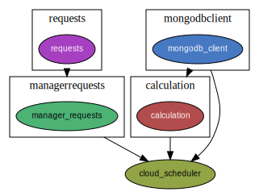

# Cloud_Scheduler




A job which is requested by the user, can have different status.

- REQUESTED: after the user contacted the system to deploy a service.
- SCHEDULED: when the scheduler took a decision
- RUNNING: when the service is running
- FAILED: if an error came up


## Design of Cloud_Scheduler

- REST API Endpoints (Flask) to get scheduling requests from System Manager
- Celery Queue to store jobs
- Celery creates one worker and calculates job by job
- Celery uses Redis database as Queue for jobs
- Cloud Scheduler sends result back by calling System Manager's REST API
- Cloud Scheduler accesses clusters and jobs db through the resource abstractor microservice.


## Built With

```Python
flask
flask_pymongo
celery
click
redis
requests
```

## Create Python Dependency Graph

- https://github.com/thebjorn/pydeps
    - apt install graphviz
    - pip install pydeps
    - pydeps [args] python_file_name.py
    - e.g. `pydeps --max-bacon 3 --max-cluster-size=1000 cluster_scheduler.py`
    - see resulting cloud_scheduler.svg