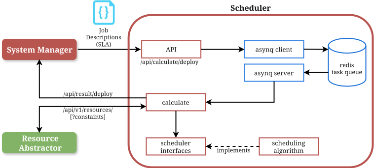

# Scheduler

The scheduler is the scheduling component of the Oakestra control plane.
It accepts deployment job requests in the form of SLAs and returns the appropriate
scheduling candidate (cluster or worker) on which the service should be scheduled.
If no appropriate candidate could be found a `NegativeSchedulingResult` is returned.

The scheduler was designed for extensibility. A new algorithm can be added by implementing
the `Job`, `Candidate`, and `Algorithm` interfaces defined in `calculate/schedulers/placement`.
The scheduler is agnostic to the underlying resource types and scheduling algorithm.

## Taxonomy

- **Job**: Describes the resource requirements of a workload. Decoded from the incoming SLA payload.
- **Candidate**: Represents a cluster or worker node with available resources. Fetched from the ResourceAbstractor.
- **BaseResources**: A shared struct embedded by concrete `Job`/`Candidate` types that carries the common fields (`_id`, `virtualization`, `memory`, `vcpus`, `cpu_percent`).
- **Algorithm**: A generic interface parameterised on `Job` and `Candidate` types that runs the placement logic.

## Architecture



1. The API module receives deployment job requests.
2. These jobs are enqueued with asynq and stored in Redis.
3. To find placement candidates, a request is sent to the ResourceAbstractor.
4. The `Calculate` function is applied to the job and the list of candidates.
5. `Calculate` is implemented by the active `Algorithm` (currently `cpumemfit.Scheduler`).
6. The chosen candidate is reported to the Manager so the job can be dispatched.

## Interfacing with the Scheduler

The scheduler exposes an API endpoint at `[API_PORT]:/api/calculate/deploy`.
`API_PORT` must be set in the docker-compose file and the port must be exposed.

The scheduler sends the result back to `[MANAGER_URL]:[MANAGER_PORT]/api/result/deploy`.
`MANAGER_URL` and `MANAGER_PORT` must be set as environment variables.

## Implementing new Scheduler behaviour

New scheduling behaviour can be added by implementing `Job`, `Candidate`, and
`Algorithm[J, C]`. These interfaces are defined in `calculate/schedulers/placement`.

### Concrete resource types

Create a struct that embeds `placement.BaseResources` to inherit the common fields:

```go
type Resources struct {
    placement.BaseResources
    Constraints []Constraints `json:"constraints"`
    // ... algorithm-specific fields
}

// ID returns the candidate or job identifier.
func (r Resources) ID() string { return r.BaseResources.ID }

// ResourceConstraints maps constraint names to values used to query the
// ResourceAbstractor (required by the Job interface).
func (r Resources) ResourceConstraints() map[string]string { ... }
```

The struct must use `json` struct tags so that `getInterestedResources` can build the
field-projection list sent to the ResourceAbstractor.

If the `virtualization` field may arrive as a bare string rather than a `[]string`,
implement a custom `UnmarshalJSON` and call `placement.NormalizeVirtualization`.

### Algorithm interface

```go
type Algorithm[J Job, C Candidate] interface {
    JobData() J                                  // returns an empty job used to decode the request payload
    Calculate(job J, candidates []C) (C, error)  // returns the best candidate, or a SchedulingError
}
```

- `JobData()` returns a zero-value `J` used as the unmarshal target for the incoming payload.
- `Calculate` receives the decoded job and the list of active candidates. Return a
  `placement.SchedulingError` with the appropriate `NegativeSchedulingStatus` when
  no suitable candidate exists.
- To switch the active algorithm, replace `cpumemfit.Scheduler{}` with your implementation
  in `cmd/tasks.go` (`activeScheduler`).

### Existing algorithms

| Package | Type | Behaviour |
|---|---|---|
| `calculate/schedulers/cpumemfit` | `Scheduler` | Picks the candidate with the most available CPU headroom and memory. Also checks virtualization type and CSI driver availability. |
| `calculate/schedulers/random` | `Scheduler` | Picks a qualifying candidate at random. |
